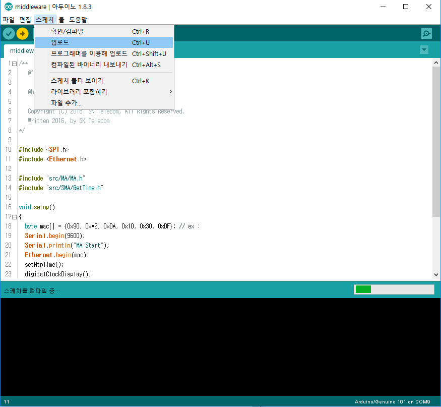
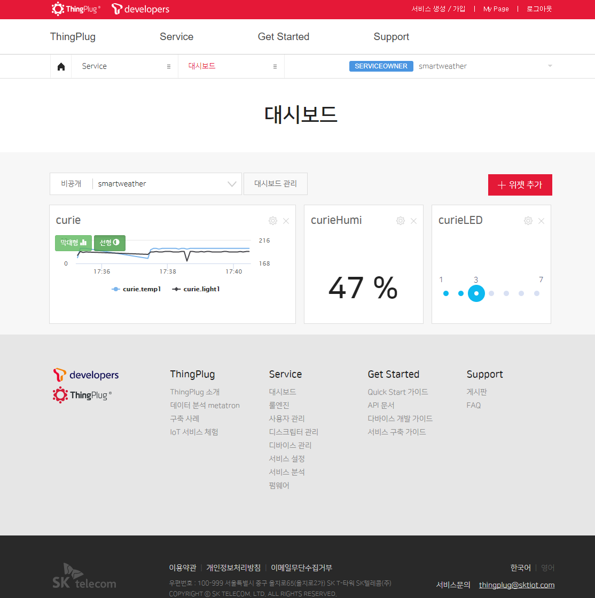

Arduino
===

지원 사양
---
1. 테스트 환경
	+ Genuino 101(Arduino 101) 
	+ CPU : 32MHz Intel Curie
	+ RAM : 24KB
	+ Flash memory : 196KB

2. 최소 동작 환경
	+ CPU : 32MHz
	+ RAM : 24KB
	+ Flash memory : 126KB
	
3. Ethernet board
	+ Arduino Ethernet Shield R3

Library
---
다음 라이브러리들을 사용합니다.

일반 라이브러리 | 용도 | 홈페이지
------------ | ------------- | -------------
__cJSON__ | JSON parser | [cJSON Homepage](https://github.com/DaveGamble/cJSON)
__paho__ | MQTT Embedded-c | [paho Homepage](https://eclipse.org/paho/)

아두이노 라이브러리 | 용도 
------------ | -------------
__Ethernet__ (IDE 설치 시 자동설치) | Ethernet 
__Time__ | Time

Project build
===

IDE 설정
---
1. IDE 설치하기
	+ https://www.arduino.cc/
	+ arduino homepage -> software(menu) -> Download the Arduino IDE(by OS) -> install
2. IDE 라이브러리 추가하기
	+ https://www.arduino.cc/en/Guide/Libraries
	+ 라이브러리 설치에 대한 자세한 설명은 공식사이트를 참고한다.

Sample build
===

Configuration 설정(Simple/examples/middleware/src/MA/Configuration.h)
---
MQTT broker 와의 연결을 위한 정보 및 디바이스 정보를 설정해야 합니다.
```c
#define MQTT_HOST                           ""
#define MQTT_PORT                           1883					
#define MQTT_KEEP_ALIVE                     120
#define SIMPLE_DEVICE_TOKEN                 ""
#define SIMPLE_SERVICE_NAME                 ""
#define SIMPLE_DEVICE_NAME                  ""
```

변수 | 값 | 용도 
------------ | ------------- | -------------
__SIMPLE_DEVICE_TOKEN__ | ThingPlug 포털을 통해 발급받은 디바이스 토큰 | MQTT 로그인 사용자명으로 사용
__SIMPLE_SERVICE_NAME__ | ThingPlug 포털을 통해 등록한 서비스명 | MQTT Topic 에 사용
__SIMPLE_DEVICE_NAME__ | ThingPlug 포털을 통해 등록한 디바이스명 | MQTT Topic 에 사용


디바이스 디스크립터와 Attribute, Telemetry
---
각 디바이스의 고유의 특성을 전달하는 Attribute 변경 통지와 센서를 통해 측정된 값을 전달하는 Telemetry 전송 데이터는 ThingPlug 포털에 등록한 디바이스 디스크립터의 내용과 1:1 매칭되어야 합니다.
다음은 포털에 등록된 디바이스 디스크립터와 매칭된 소스코드 예시입니다.

```json
"Airconditioner": {
     "telemetries": [{"name":"temperature","type":"number"}, {"name":"humidity","type":"int"}],
     "attribute": [{"name":"control","type":"string"}]
 }
```

```c
void telemetry() {
    double temp = 27.05;
    int humi = 75;

    ArrayElement* arrayElement = calloc(1, sizeof(ArrayElement));    
    arrayElement->capacity = 2;
    arrayElement->element = calloc(1, sizeof(Element) * arrayElement->capacity);

    Element* item = arrayElement->element + arrayElement->total;
    item->type = JSON_TYPE_DOUBLE;
    item->name = "temperature";	
    item->value = &temp;
    arrayElement->total++;

    item = arrayElement->element + arrayElement->total;
    item->type = JSON_TYPE_LONG;
    item->name = "humidity";
    item->value = &humi;
    arrayElement->total++;
    
    tpSimpleTelemetry(arrayElement, 0);
    free(arrayElement->element);
    free(arrayElement);
}

void attribute() {
    char *status = "stopped";
	
    ArrayElement* arrayElement = calloc(1, sizeof(ArrayElement));    
    arrayElement->capacity = 1;
    arrayElement->element = calloc(1, sizeof(Element) * arrayElement->capacity);
    
    Element* item = arrayElement->element + arrayElement->total;
    item->type = JSON_TYPE_STRING;
    item->name = "control";
    item->value = status;
    arrayElement->total++;

    tpSimpleAttribute(arrayElement);
    free(arrayElement->element);
    free(arrayElement);
}

```

Arduino SimpleAPI example 실행하기
---
1. 라이브러리 추가하기 (windows)

	```
	C:\Users\{$USER}\Documents\Arduino\libraries에 Time 폴더를 복사한다.
	```
	
2. 라이브러리 예제 실행하기 

	```
	Simple 폴더 Simple.ino 실행
	```
	
3. 컴파일 및 실행 

	```
	사전 작업 : Configuration.h 파일 작성필수
	컴파일 : 메뉴->스케치->컴파일->업로드
	실행 : 업로드가 완료되면 자동으로 실행
	```
	
	
	
ThingPlug_Simple_SDK 실행
---
1. 실행 로그 확인
---
[LOG_Arduino.txt](./LOG_Arduino.txt)
---
2. Thingplug SensorData
---

